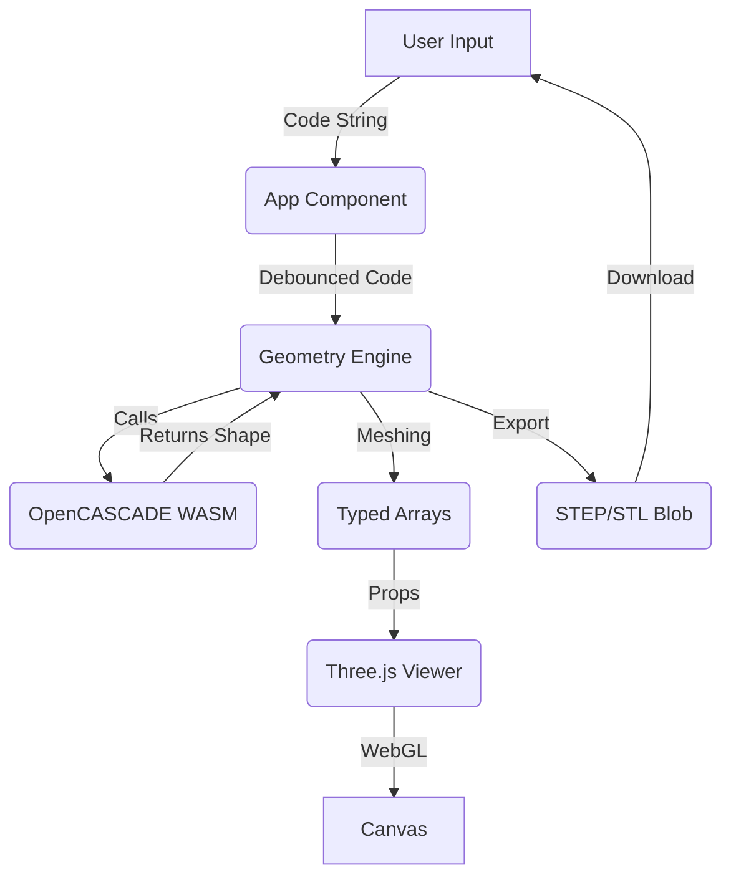

# Architecture

kernelCAD is a browser-based programmatic CAD application. It combines a React UI with a powerful "serverless" geometry engine running entirely in the client via WebAssembly (WASM).

## Architecture

## High-Level Overview

kernelCAD follows a **Workbench Architecture** designed for modularity and separation of concerns.

```mermaid
graph TD
    Entry[main.tsx] --> Provider[WorkbenchProvider]
    Provider --> CodeProvider
    Provider --> UIProvider
    Provider --> SelectionProvider
    Provider --> GeometryProvider
    
    Layout --> Header
    Layout --> Sidebar[Left Pane]
    Layout --> Workspace
    
    Sidebar --> Toolbar
    Sidebar --> SidePanel[Scene Browser]
    
    Workspace --> Editor[Code Editor]
    Workspace --> Viewer[3D Viewer]
    
    subgraph Contexts
        CodeProvider --> CodeContext
        UIProvider --> UIContext
        SelectionProvider --> SelectionContext
        GeometryProvider --> GeometryContext
    end
    
    subgraph Core Logic
        Engine[Geometry Engine (Class)]
        Worker[Web Worker]
        Analysis[Code Analysis / AST]
        Builder[CodeBuilder]
    end
    
    GeometryContext <--> Engine
    Engine <--> Worker
```

## Core Components

### 1. Context System (`src/context/`)
The monolithic `WorkbenchContext` has been split into focused contexts:
-   **CodeContext**: Manages code content, editor instance, insertion logic, and undo/redo history.
-   **GeometryContext**: Handles the `GeometryEngine` instance, execution lifecycle, and mesh data.
-   **UIContext**: Controls view modes ('code' vs 'gui'), dialogs, and panels.
-   **SelectionContext**: Manages user selection state (faces, edges) and highlighting.

**Backward Compatibility**: `WorkbenchContext` re-exports a composed hook `useWorkbench()` that aggregates these contexts for legacy components.

### 2. Layout System (`src/components/Layout/`)
-   **WorkbenchLayout**: The main shell. Handles the responsive grid, sidebar resizing, and visibility toggling.
-   **Header**: Application controls (Export, View Toggle).
-   **SidePanel**: Context-aware sidebar (currently hosts the Scene Browser).

### 3. Feature System (`src/features/`)
The workbench uses a plugin-style feature registry to handle CAD operations:
-   **CodeBuilder**: A standardized fluent API (`src/lib/CodeBuilder.ts`) for generating robust, unique code snippets.
-   **FeatureRegistry**: Central hub where tools are registered.
-   **Decoupled Tools**: Standalone features trigger custom dialogs via `setActiveDialog`.

### 4. Logic Hooks
-   **useCodeInsertion**: Encapsulates the smart logic for inserting code snippets. It handles:
    -   Finding the correct insertion point (scoping).
    -   Generating unique variable names.
    -   Updating return statements automatically.

### 4. Geometry Engine (`src/lib/geometryEngine.ts`)
A class-based facade over the OpenCASCADE/Replicad kernel.
-   **Architecture**: Implements a Singleton pattern for global access (`GeometryEngine.getInstance()`) while allowing Dependency Injection in tests.
-   **Worker Protocol**: Uses a **Type-Safe Messaging Protocol** (`workerTypes.ts`) with discriminated unions for reliable Main<->Worker communication.
-   **Execution**: Code is executed in a sandboxed Web Worker to ensure UI responsiveness.
-   **Error Handling**: Centralized error management for execution failures.

### 5. Code Analysis (`src/lib/codeAnalysis.ts`)
Provides static analysis capabilities:
-   **`extractVariables`**: Regex/AST parsing to find defined shapes (`const box = ...`) for the Scene Browser.
-   **`findInsertionPoint`**: Heuristic to find where `drawPart()` returns.

### 6. Sketch Canvas (`src/components/SketchCanvas.tsx`)
A 2D drawing overlay for visual sketch creation:
-   **Canvas-Based Drawing**: HTML5 Canvas with grid overlay for precise sketching.
-   **Tools**: Line, Rectangle, Circle with click-to-draw interface.
-   **Plane Support**: Works with named planes (XY, XZ, YZ) or face-derived planes.
-   **Code Generation**: Completed sketches are converted to Replicad Sketcher code via `sketchCodegen.ts`.

### 7. Reliability Layer (`src/lib/safeSketch.ts`)
Wraps the Replicad Sketcher API to handle edge cases robustly:
-   **SafeSketcher Class**: Tracks cursor position and loop state to prevent invalid geometry.
-   **createSafeReplicad Factory**: Returns a modified replicad object with SafeSketcher as a drop-in replacement.
-   **Error Prevention**: Handles redundant `movePointerTo()` calls, auto-closes open loops, and validates operations.


### 8. System Reliability
- **Error Boundaries**: `src/components/ErrorBoundary.tsx` wraps the workbench to catch React lifecycle errors.
- **Code Rescue**: `src/components/ErrorFallback.tsx` provides a safe UI to recover/download code if the app crashes.
- **Geometry Regression Suite**: `src/features/geometryRegression.test.ts` executes real kernel logic (in Node) to verify that primitives and boolean operations produce mathematically correct results (Volume, Bounds).
- **Workflow Integration**: 
    - `src/features/standardWorkflows.test.ts`: Validates end-to-end code generation and execution logic.
    - `src/features/guiIntegration.test.tsx`: Validates UI (Toolbar -> Dialog -> Code) wiring using `happy-dom`.

## Data Flow
1.  **Selection**: User selects a tool from the **Toolbar**.
2.  **Execution**: 
    -   If the tool has **parameters**, `WorkbenchLayout` opens a `ParameterDialog`.
    -   If the tool is **standalone** (like Extrude), it calls `setActiveDialog` to open a custom selection dialog.
3.  **Insertion**: After confirmation, the feature's `execute` logic calls `insertCode`.
4.  **Computation**: Monaco triggers `onChange` -> `WorkbenchContext` debounces -> Worker executes Replicad code.
5.  **View Update**: Worker returns meshes -> Viewer re-renders.
-   **`src/lib/geometryHelpers.ts`**: Helper functions injected into the user scope (e.g., `fillet`, `chamfer`, `makeCompound`).
-   **`src/lib/geometryExports.ts`**: Handles conversion of shapes to **STEP** and **STL** blobs for download.

### 2. The Viewer (`src/components/Viewer.tsx`)
A declarative 3D viewport built with `react-three-fiber`.

-   **Scene**: OrbitControls, GridHelper, Lights.
-   **Rendering**: Takes mesh data from the engine and updates the `THREE.BufferGeometry`.
-   **Interaction Layer**: (Upcoming) A high-performance overlay for **Transform Gizmos** and **Face/Edge Selection**, enabling direct manipulation of solids.
-   **Performance**: Reacts to `geometries` state changes.

### 3. The Editor (`src/components/Editor.tsx`)
A wrapper around the Monaco Editor.

-   **Language**: JavaScript/TypeScript syntax highlighting.
-   **Feedback**: Displays error markers and "toast" notifications on runtime failures.

## Data Flow



## Geometric References & Topological Naming

### The Problem
A classic CAD issue is the **Topological Naming Problem**. If a user sketches on "Face 12" and then modifies the model history, "Face 12" might change ID or disappear, breaking downstream features.

### The Solution: Construction Planes (Datum)
We mitigate this by **decoupling references**. Instead of attaching sketches directly to volatile IDs, we encourage an intermediate step:
1.  **Capture**: User selects a Face.
2.  **Stabilize**: The system generates a `new Plane(...)` constructor code using the face's *current* geometric properties (Origin, Normal).
3.  **Reference**: Sketches use this stable `const plane_face12 = ...` variable.

This "Construction Plane" entity acts as a stable anchor that persists even if the original face ID changes, preserving the user's intent.

## Boundaries & Constraints
-   **No DOM Access in Kernel**: The geometry code runs in a sandbox (conceptually) and should not manipulate the DOM.
-   **WASM Asset**: The `opencascade.wasm` file is large (~10MB) and must be served correctly with the correct MIME type. We serve it statically from `public/`.
-   **Three.js Compatibility**: Three.js is strict about TypedArrays. All mesh data crossing the boundary from Replicad (which might output plain arrays) must be cast to `Float32Array` or `Uint32Array`.

## Tech Stack
-   **UI**: React, Tailwind CSS
-   **Build**: Vite
-   **Language**: TypeScript
-   **Geometry**: Replicad (OpenCASCADE wrapper)
-   **3D**: Three.js, React Three Fiber, Drei
-   **Editor**: Monaco Editor
