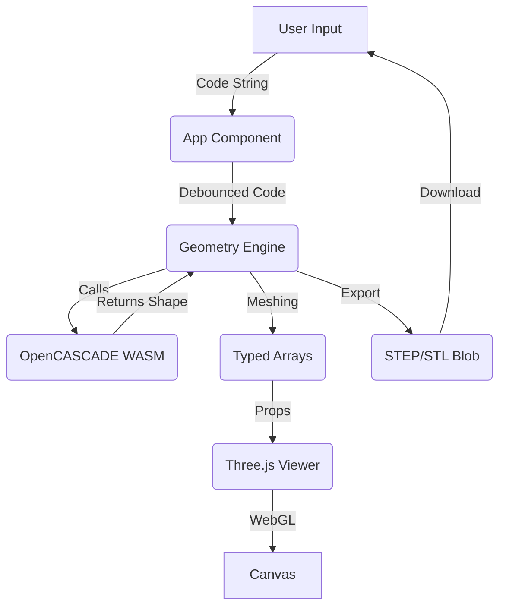

# Architecture

kernelCAD is a browser-based programmatic CAD application. It combines a React UI with a powerful "serverless" geometry engine running entirely in the client via WebAssembly (WASM).

## High Level Design
kernelCAD follows a "thick client" architecture where all geometry processing happens locally in the user's browser. There is no backend server for geometry generation.

**Key Components:**
1.  **Editor (UI Thread)**: Monaco-based code editor for user input.
2.  **Geometry Kernel (WASM)**: Replicad (OpenCASCADE.js) running in the main thread (for now, future: Worker).
3.  **Viewer (WebGL)**: Three.js / React Three Fiber renderer.

## Core Components

### 1. The Geometry Engine (`src/lib/geometryEngine.ts`)
This is the bridge between the user's JavaScript code and the OpenCASCADE kernel.

-   **Initialization**: Dynamically loads the `opencascade.wasm` binary from the `public/` directory.
-   **Execution**:
    1.  User code -> `new Function()` sandbox.
    2.  Injected `replicad` instance and helpers.
    3.  Returns `replicad.Shape` objects.
-   **Meshing**: Converts parametric shapes into triangular meshes (`vertices`, `indices`, `normals`) suitable for Three.js.
-   **Safety**: Explicitly converts plain arrays to `Float32Array`/`Uint32Array` to prevent WebGL crashes.

### 1a. Helpers & Exports
To maintain modularity, logic is split into:
-   **`src/lib/geometryHelpers.ts`**: Helper functions injected into the user scope (e.g., `fillet`, `chamfer`, `makeCompound`).
-   **`src/lib/geometryExports.ts`**: Handles conversion of shapes to **STEP** and **STL** blobs for download.

### 2. The Viewer (`src/components/Viewer.tsx`)
A declarative 3D viewport built with `react-three-fiber`.

-   **Scene**: OrbitControls, GridHelper, Lights.
-   **Rendering**: Takes mesh data from the engine and updates the `THREE.BufferGeometry`.
-   **Performance**: Reacts to `geometries` state changes.

### 3. The Editor (`src/components/Editor.tsx`)
A wrapper around the Monaco Editor.

-   **Language**: JavaScript/TypeScript syntax highlighting.
-   **Feedback**: Displays error markers and "toast" notifications on runtime failures.

## Data Flow

## Boundaries & Constraints
-   **No DOM Access in Kernel**: The geometry code runs in a sandbox (conceptually) and should not manipulate the DOM.
-   **WASM Asset**: The `opencascade.wasm` file is large (~10MB) and must be served correctly with the correct MIME type. We serve it statically from `public/`.
-   **Three.js Compatibility**: Three.js is strict about TypedArrays. All mesh data crossing the boundary from Replicad (which might output plain arrays) must be cast to `Float32Array` or `Uint32Array`.

## Tech Stack
-   **UI**: React, Tailwind CSS
-   **Build**: Vite
-   **Language**: TypeScript
-   **Geometry**: Replicad (OpenCASCADE wrapper)
-   **3D**: Three.js, React Three Fiber, Drei
-   **Editor**: Monaco Editor
