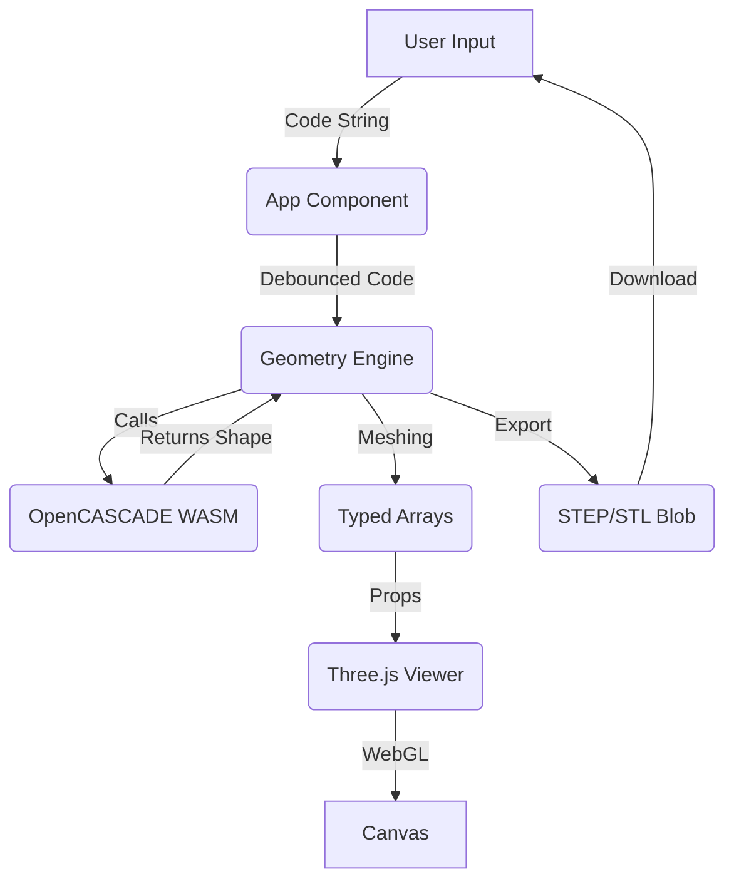

# Architecture

kernelCAD is a browser-based programmatic CAD application. It combines a React UI with a powerful "serverless" geometry engine running entirely in the client via WebAssembly (WASM).

## Architecture

## High-Level Overview

kernelCAD follows a **Workbench Architecture** designed for modularity and separation of concerns.

```mermaid
graph TD
    Entry[main.tsx] --> Provider[WorkbenchProvider]
    Provider --> Layout[WorkbenchLayout]
    
    Layout --> Header
    Layout --> Sidebar[Left Pane]
    Layout --> Workspace
    
    Sidebar --> Toolbar
    Sidebar --> SidePanel[Scene Browser]
    
    Workspace --> Editor[Code Editor]
    Workspace --> Viewer[3D Viewer]
    
    subgraph State Management
        Context[WorkbenchContext]
    end
    
    subgraph Core Logic
        Engine[Geometry Engine (Replicad)]
        Worker[Web Worker]
        Analysis[Code Analysis / AST]
    end
    
    Context <--> Engine
    Layout --> Context
    Editor --> Context
    Viewer --> Context
```

## Core Components

### 1. Workbench Context (`src/context/WorkbenchContext.tsx`)
The central nervous system of the application. It holds global state:
-   **Code**: The source of truth for the model.
-   **ViewMode**: 'code' (Editor+Viewer) or 'gui' (Viewer+Browser).
-   **Geometries**: The computed meshes displayed in the viewer.
-   **Status**: `isComputing`, `error`, `isReady`.

### 2. Layout System (`src/components/Layout/`)
-   **WorkbenchLayout**: The main shell. Handles the responsive grid, sidebar resizing, and visibility toggling.
-   **Header**: Application controls (Export, View Toggle).
-   **SidePanel**: Context-aware sidebar (currently hosts the Scene Browser).

### 3. Logic Hooks
-   **useCodeInsertion**: Encapsulates the smart logic for inserting code snippets. It handles:
    -   Finding the correct insertion point (scoping).
    -   Generating unique variable names.
    -   Updating return statements automatically.

### 4. Geometry Engine (`src/lib/geometryEngine.ts`)
A facade over the OpenCASCADE/Replicad kernel.
-   **Execution**: Code is sent to a **Web Worker** (`src/worker.ts`) to prevent UI freezing.
-   **Evaluation**: The worker uses `new Function()` to execute the user's code in a sandboxed scope.
-   **Meshing**: Replicad converts the BREP shapes to three.js-compatible BufferGeometry.

### 5. Code Analysis (`src/lib/codeAnalysis.ts`)
Provides static analysis capabilities:
-   **`extractVariables`**: Regex/AST parsing to find defined shapes (`const box = ...`) for the Scene Browser.
-   **`findInsertionPoint`**: Heuristic to find where `drawPart()` returns.

## Data Flow
1.  **User Action**: User clicks "Box" in Toolbar.
2.  **Insertion**: `useCodeInsertion` updates the text in Monaco Editor.
3.  **Change Detection**: Editor triggers `onChange`.
4.  **Debounce**: `WorkbenchContext` waits 600ms.
5.  **Computation**: Code is sent to Worker.
6.  **Update**: Worker returns meshes -> Context updates `geometries` -> Viewer re-renders.
-   **`src/lib/geometryHelpers.ts`**: Helper functions injected into the user scope (e.g., `fillet`, `chamfer`, `makeCompound`).
-   **`src/lib/geometryExports.ts`**: Handles conversion of shapes to **STEP** and **STL** blobs for download.

### 2. The Viewer (`src/components/Viewer.tsx`)
A declarative 3D viewport built with `react-three-fiber`.

-   **Scene**: OrbitControls, GridHelper, Lights.
-   **Rendering**: Takes mesh data from the engine and updates the `THREE.BufferGeometry`.
-   **Performance**: Reacts to `geometries` state changes.

### 3. The Editor (`src/components/Editor.tsx`)
A wrapper around the Monaco Editor.

-   **Language**: JavaScript/TypeScript syntax highlighting.
-   **Feedback**: Displays error markers and "toast" notifications on runtime failures.

## Data Flow



## Boundaries & Constraints
-   **No DOM Access in Kernel**: The geometry code runs in a sandbox (conceptually) and should not manipulate the DOM.
-   **WASM Asset**: The `opencascade.wasm` file is large (~10MB) and must be served correctly with the correct MIME type. We serve it statically from `public/`.
-   **Three.js Compatibility**: Three.js is strict about TypedArrays. All mesh data crossing the boundary from Replicad (which might output plain arrays) must be cast to `Float32Array` or `Uint32Array`.

## Tech Stack
-   **UI**: React, Tailwind CSS
-   **Build**: Vite
-   **Language**: TypeScript
-   **Geometry**: Replicad (OpenCASCADE wrapper)
-   **3D**: Three.js, React Three Fiber, Drei
-   **Editor**: Monaco Editor
