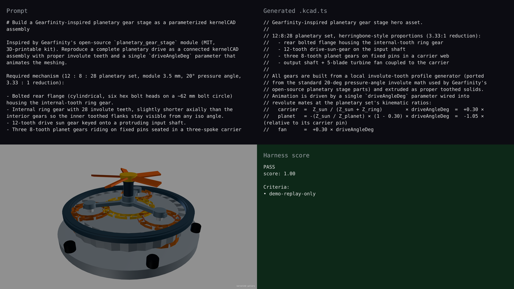

# gallery — synchronized live-build demo

## Hero artifact

gearfinity-planetary-stage

## Why memorable

- Recognizable in one second: a complete planetary gear stage with internal-tooth ring, three orange planets meshing against a gold sun, and a turbine fan output — reads as a real reduction gearbox, not a generic CAD shape.
- New tool central: the entire 24-part mechanism animates from a single `driveAngleDeg` ParamRef wired into six revolute mates at the planetary set's kinematic ratios (carrier = +0.30×, planet-rel-pin = −1.05×, fan = +0.30×).
- Reads at 360°: the open 3-spoke carrier and gears that protrude axially past the ring's flat face keep the meshing visible from every angle in the rotate phase, not just the front.

## What's new

This gallery demo shows the agent building a Gearfinity-inspired 12 : 8 : 28 planetary gear stage as a connected kernelCAD assembly with proper 20° pressure-angle involute teeth — bolted rear flange, internal ring gear, drive sun, three planets on carrier pins, slewing roller bearing race, output shaft, and a 5-blade turbine fan — all driven by one `driveAngleDeg` ParamRef. A parameterized kinematic preview, not a full involute meshing simulation; the visible scrub through the rotate phase is mate-pose math, and the mesh-cache fast path keeps live param edits responsive (~5 ms on the engine side after the initial build).

