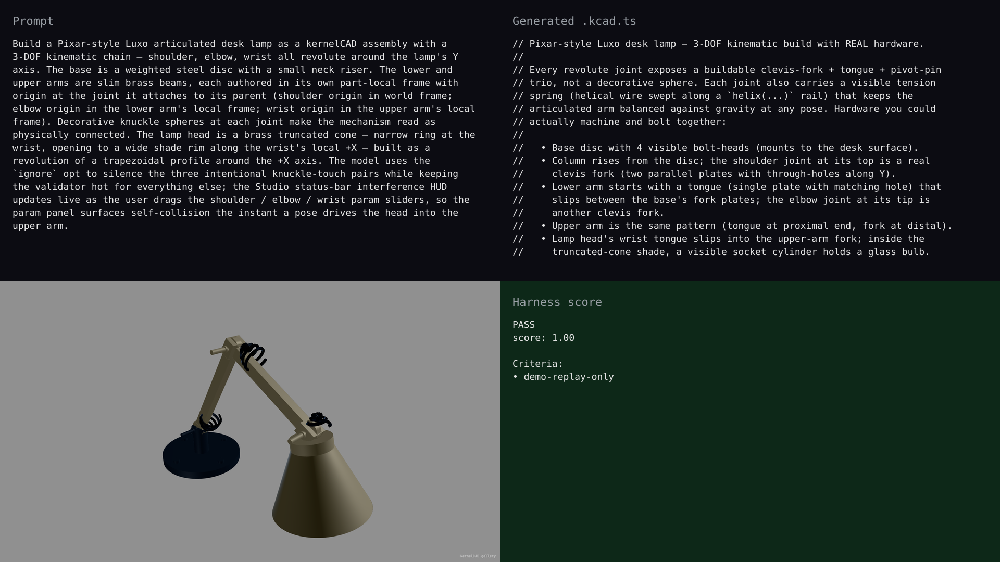

# gallery — Luxo articulated desk lamp

## Hero artifact

luxo-lamp

## Why memorable

- Recognizable in one second: disc base + slim articulated arm + truncated-cone shade reads as a Pixar/Luxo desk lamp from any angle, with knuckle spheres marking the shoulder, elbow, and wrist joints.
- New tool central: first gallery model to use v0.11.1's granular `solvedModel(..., { ignore: [['head', 'upper-arm'], ...] })` opt to silence intentional joint-knuckle contacts while keeping the validator and Studio's live interference HUD hot for everything else — drag the shoulder slider in Studio Params and watch the count climb the moment the head clips the upper arm.
- Reads at 360°: the FK-folded pose (shoulder up, elbow folded back, wrist tilted forward) silhouettes as a desk lamp from front, 3/4, and side; the rotate phase exposes the disc base and the open lamp shade rim equally well.

## What's new

A 3-DOF articulated assembly (shoulder + elbow + wrist, all revolute around -Y) built with the part-local-frame convention spelled out in `kernelcad-assemblies/SKILL.md` after PR #310: each child's geometry sits in its own frame with origin at the joint where it attaches to its parent, and the joint origin is expressed in the parent's local frame. Combined with the `ignore: pair[]` opt and the live raw-interference HUD shipped in PR #315, the model lets users declare the three intentional knuckle-touch pairs without losing the kinematic-feasibility signal everywhere else — the experience is "drag a slider, see the count, know you broke something."

