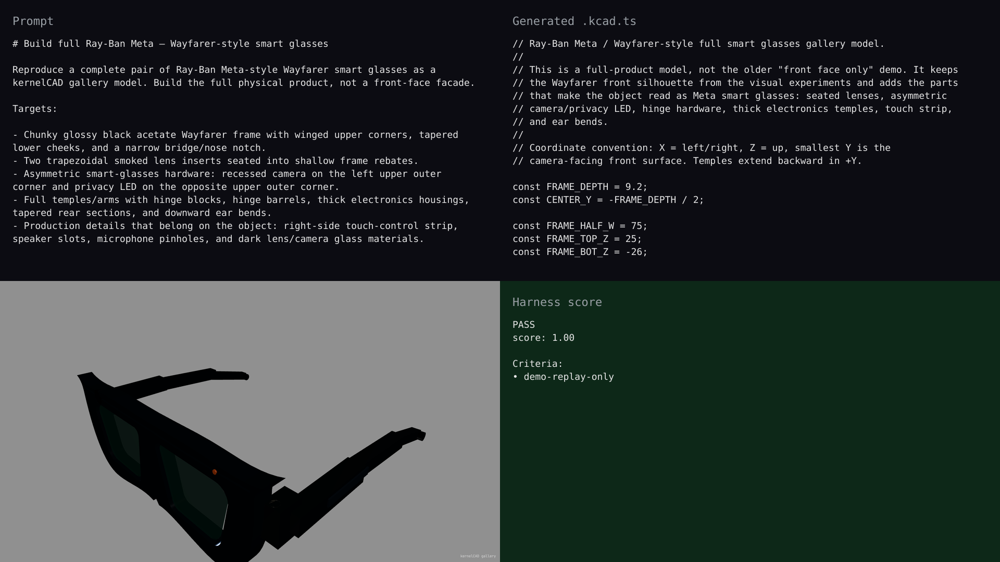

# gallery — synchronized live-build demo

## Hero artifact

meta-glasses

## Why memorable

- Recognizable in one second: full Wayfarer-style smart glasses with a winged black acetate front, smoked lenses, camera, and opposite-side privacy LED.
- New tool central: the gallery build now uses a named static assembly so GLB export preserves every visible part instead of collapsing to a single tail shape.
- Reads at 360°: thick electronics temples, hinge barrels, touch strip, speaker slots, mic details, and ear bends make the model read as a full product from side and rear views.

## What's new

The Meta glasses gallery model is now a full smart-glasses assembly rather than a front-face facade. The build includes seated translucent lenses, asymmetric camera/LED hardware, connected hinge blocks, thick electronics temples, production detail inserts, and regenerated gallery media.

