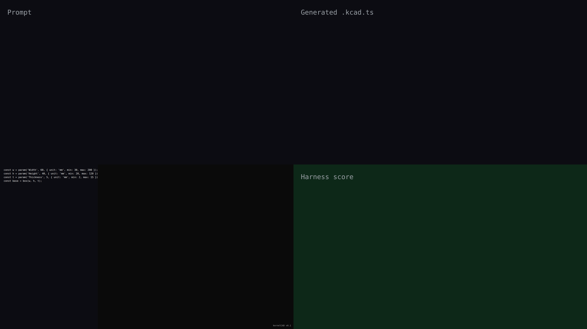

# v0.1 — NORTHSTAR baseline (first public ship)

The v0.1.0 release establishes the kernelCAD NORTHSTAR baseline: parametric box + cylinder primitives, boolean operations (subtract), and edge-feature fillets — all script-driven from `.kcad.ts` source. Demonstrated by the canonical mounting bracket: a plate with a centered through-hole and rounded edges, parameterized by width, height, and thickness.

