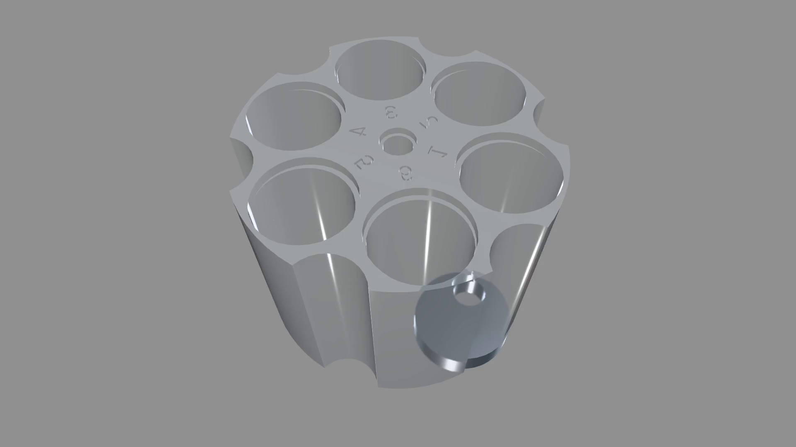

# v0.12 — spice-dispenser carousel dispense-cycle hero

## Hero artifact

spice-dispenser-carousel — a Ø88 "carousel in a can" spice dispenser. A six-chamber chamber drum indexes the next chamber over a single metering station while a pocket disc swings ~117° to meter and drop a ~0.5 ml dose down an enclosed chute. The hero is a cutaway MP4 of the full dispense cycle, driven by the v0.12 `animationView()` keyframe timeline.

## Why memorable

- Reads in one second as a real machine: two sealed degrees of freedom — a rotating chamber drum and a metering disc — visibly cooperate to dose a measured amount, not an abstract solid spinning on a turntable.
- New tool central: the motion *is* the deliverable. The v0.12 `animationView()` keyframe tracks drive `drumDeg` (index → hold → re-home) and `meterDeg` (swing → dwell → return); without the animation toolset there is only a static cutaway.
- Choreography is the proof: the two DOFs never move at once — exactly what the sealed-valve architecture needs to stay collision-free — and the sampled-pose interference verification confirms the cycle is clean at every keyframe and segment midpoint.

## What's new

v0.12 ships the agent animation toolset. `animationView({ tracks })` declares keyframe timelines over numeric params with per-segment easing; `kernelcad animate <file> [out.mp4]` captures the timeline to MP4 (or a PNG sequence) with sampled-pose interference verification; the `capture_animation` MCP tool mirrors the CLI; and Studio's Animation tab scrubs/plays the same timeline via a bake-once + client-interpolation path. This release also lands the print-readiness DFM suite (`kernelcad dfm`), STEP inspection (`inspect_step`), Studio cutaway sections, the parts catalog + export trio (DXF/3MF/GLB), hosted multi-user session hardening, and generation-loop tightening — full notes in `CHANGELOG.md`.

