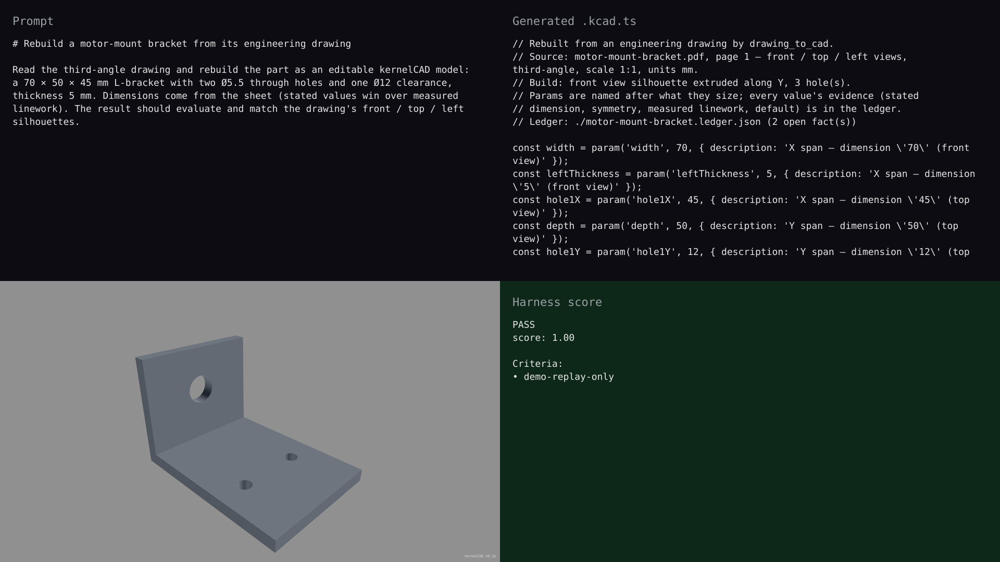

# v0.16 — drawing PDF to an editable part

## Hero artifact

napkin-sketch-to-3d — a 70 × 50 × 45 mm motor-mount L-bracket rebuilt from
its third-angle engineering drawing: stated dimensions, two Ø5.5 through
holes and one Ø12 clearance, 5 mm wall. The script is the `drawing_to_cad`
output (`examples/drawing-to-cad/motor-mount-bracket.kcad.ts`); fidelity
against the sheet is match on hole diameters and view silhouettes.

## Why memorable

- Recognizable in one second: an L-bracket with a bolt pattern, not a box.
- New tool central: `drawing_to_cad` reads vector linework and dimension
  text from a PDF with no vision model, then emits editable `.kcad.ts`
  plus an assumption ledger.
- Reads at 360°: the rebuilt solid is the same part from every view; the
  drawing's front / top / left silhouettes match.

## What's new

v0.16 lands the steal-list train: drawing PDF → CAD, auto GD&T, FEA
safety-factor gate, G-code print loop, mesh-to-features, exploded views,
cookbook hardware recipes, and Studio routing so Param arithmetic and
TypeScript models run on the full kernel. Full notes in `CHANGELOG.md`.

