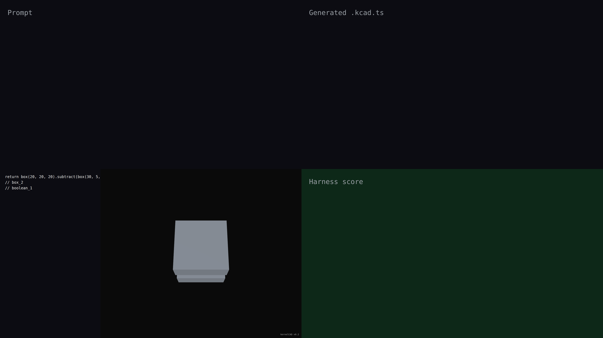

# v0.2 — boolean operations on tracked geometry

v0.2.0 demonstrates kernelCAD's boolean engine: subtracting a slim divider from a cube produces a U-shaped channel where the cut edges, faces, and rim are tracked through the operation. Subsequent fillets and modifiers can address those tracked refs by name.

