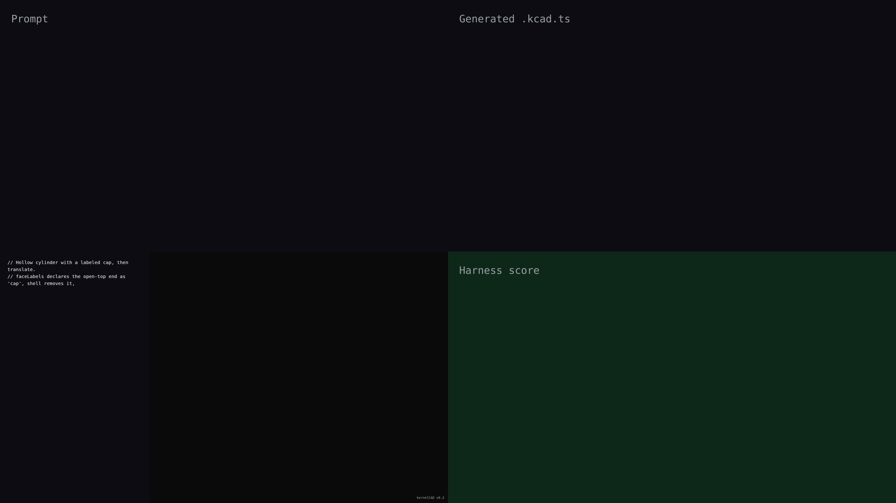

# v0.2 — synchronized live-build demo

## Hero artifact

A hollow cylinder of radius 10 mm and height 20 mm with the open-top end labeled `cap`. Shell removes 2 mm of wall thickness through the labeled face, then `.translate(5, 0, 0)` moves the result.

## Why memorable

- Recognizable in one second: a hollow open-top cylinder — the shell operation is immediately visible as the missing cap face and thin walls.
- New tool central: `faceLabels` on `cylinder` using the canonical-alias form `{ cap: 'top' }` is declared at construction, consumed by `.shell(2, { face: 'cap' })` — both calls are in the script.
- Reads at 360°: the open top, thin cylindrical wall, and offset position are all visible from any rotation angle.

## What's new

- `faceLabels` accepted on `cylinder` (v0.2 — this iteration).
- Canonical-alias values (e.g. `{ cap: 'top' }`) resolve through the existing canonical-ref machinery, inheriting full lineage tracking through transforms and unambiguous booleans.
- Discoverable via the existing `inspect({ of: 'face-labels' })` MCP tool.

