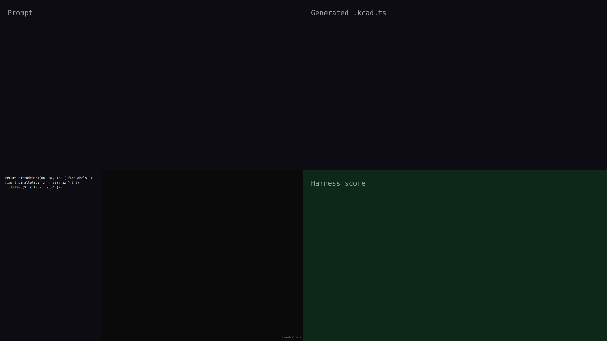

# v0.2 — synchronized live-build demo

## Hero artifact

A 60×30×12 mm mounting bracket with a fillet around its top rim — the rim is named via `faceLabels` at the `extrudeRect` call site and consumed by `.fillet(3, { face: 'rim' })`.

## Why memorable

- Recognizable in one second: a compact rectangular bracket with visibly rounded top edges — the fillet is the whole point.
- New tool central: `faceLabels` on `extrudeRect` is used to declare the rim label; `.fillet({ face: 'rim' })` consumes it — both calls are in the script.
- Reads at 360°: the rounded rim is visible from every rotation angle; the flat bottom and sharp lower edges provide contrast.

## What's new

v0.2 adds `faceLabels` support to extrude helpers (`extrudeRect`, `extrudeCircle`, `extrudePolygon`, `extrudeRoundedRect`). A label is declared using a `FaceQuery` descriptor at the extrude site; the query is resolved against the lowered shape when a downstream operation (fillet, chamfer, shell) consumes it by name. This replaces the boilerplate of repeating the same geometric query twice or relying on canonical-name aliases that may not survive transforms.

