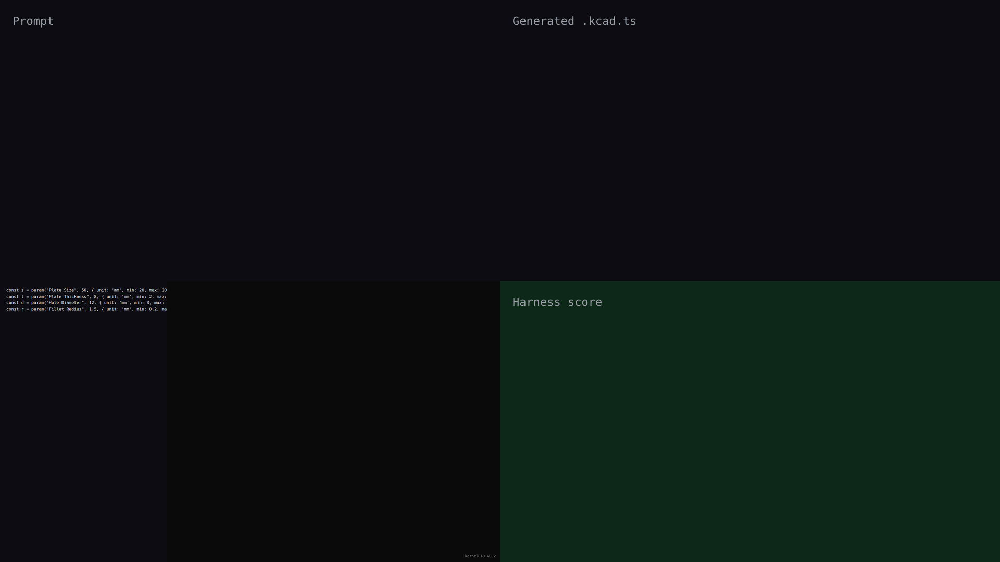

# v0.2 — tracked face/edge refs through transforms and booleans

v0.2.0 lets agents reference faces and edges that don't exist in the source primitives — refs survive booleans and transforms. The plate-with-rim demo shows the agent applying `.fillet(r, { face: 'top' })` after a `subtract`: the kernel tracks the canonical "top" face through the boolean cut so the fillet picks up both the outer perimeter and the new circular rim around the hole. No imperative edge selection or boolean-then-fillet ordering tricks required.

