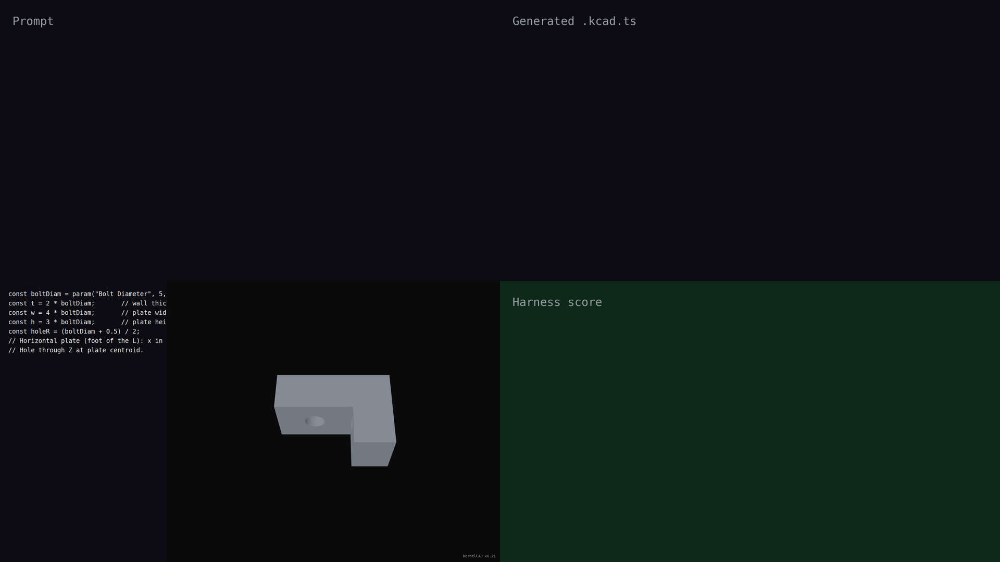

# v0.21 — synchronized live-build demo automation

This release introduces the synchronized live-build capture pipeline. Every per-module ship now produces a promo-grade MP4 video showing the agent's `.kcad.ts` typed in real time on the left, with each feature animated as it's compiled on the right — followed by a showcase rotate. Demonstrated by a parametric L-bracket assembled from primitive box and cylinder features, with a boolean cut creating the bolt hole and a fillet on the result.

