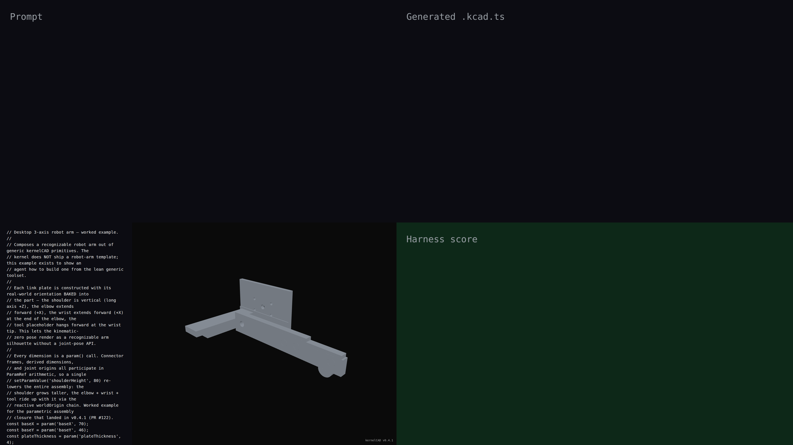

# v0.4.1 — parametric assembly closure (robot arm)

## Hero artifact

robot-arm-parametric

## Why memorable

- Recognizable in one second: a desktop 3-axis robot arm — horizontal base plate, vertical shoulder column, forward-reaching elbow + wrist, tool placeholder at the end.
- New tool central: every dimension is a `param()`, every connector frame uses `[baseX.divide(2), ...]`, and joint origins pass `connector.worldOrigin` directly through the `EditableVec3 | Vec3Param` union — exercising the parametric assembly surface that landed in v0.4.1 (PR #122).
- Reads at 360°: silhouette stays recognizable from every angle of the rotation; the L-shape (vertical shoulder + horizontal forearm) reads as an articulated arm even without a joint-pose API.

## What's new

v0.4.1 closes parametric authoring across the assembly surface. Connector frames, joint origins, and joint axes all accept ParamRefs per coord, and an `AssemblyConnectorRef.worldOrigin` is a symbolic Vec3 that propagates through chained joints. A single `setParamValue('shoulderHeight', 80)` re-lowers the base plate, the shoulder column (taller), the dependent elbow placement (rides up), the wrist, and the tool — all in one pass via the reactive worldOrigin chain. The robot arm worked example demonstrates the full closure: 14 `param()`s, `ParamRef.add/subtract/multiply/divide/negate` across every derived dimension, 4 parts joined by 3 revolute joints whose origins are read from upstream `worldOrigin` symbolic frames, and each link constructed with its real-world orientation baked in so the kinematic-zero pose renders as a recognizable arm without requiring a joint-pose API.

