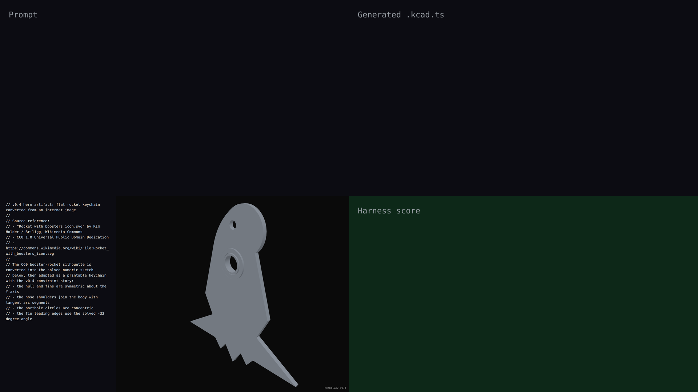

# v0.4 — synchronized live-build demo

## Hero artifact

Rocket keychain converted from a CC0 Wikimedia Commons booster-rocket icon.

## Why memorable

- Recognizable in one second: the silhouette is a rocket charm with fins, nose cone, porthole, and keyring hole.
- New tool central: the production geometry comes from a solved constrained sketch using symmetry, tangent arcs, concentric circles, angle constraints, and dimensions.
- Reads at 360°: the flat extruded outline and raised porthole rings stay legible through the rotate phase.

## What's new

This release demonstrates the v0.4 constrained-sketch workflow: an image-derived rocket outline is solved as explicit sketch entities, then converted into a printable keychain script with literal numeric geometry. The capture shows the agent building the hull, fin angles, tangent nose arcs, concentric porthole rings, through holes, and raised lip details as a synchronized live-build.

