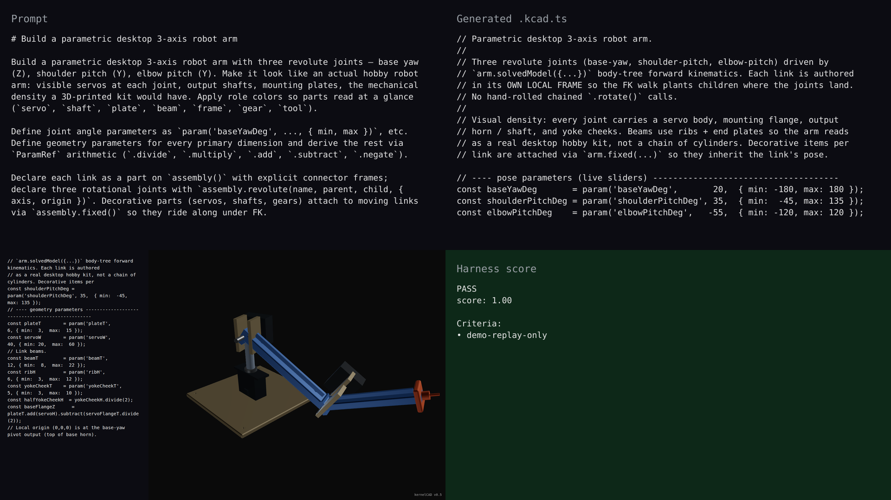

# v0.5 — synchronized live-build demo

## Hero artifact

robot-arm-3axis-parametric

## Why memorable

- Recognizable in one second: a desktop hobby robot arm with named, colored parts (servos, beams, plates, end-effector) — reads as a real machine, not abstract geometry.
- New tool central: `arm.solvedModel(poses)` now returns a multi-body `Scene` instead of a boolean union, so per-part identity (color, name, transform) survives all the way to the renderer and STEP export — no fusion until you ask for it.
- Reads at 360°: per-part FK-posed transforms expose the body-tree articulation; the 8-second rotation phase shows three driven joints (base-yaw, shoulder-pitch, elbow-pitch) plus the decorative attachments riding along.

## What's new

This release ships the **assembly scene-graph slice**: `Assembly.solvedModel(poses)` and `Assembly.model()` return a frozen ordered `Scene` of `ScenePart` records — each with a name, world transform, role color, and optional metadata. Boolean fusion is now an opt-in `scene.toCompound()` (lossless OCCT group, default for STEP) or `scene.toUnion()` (explicit fuse, antipattern). The robot-arm hero authors 13 parts in their own local frames and lets the body-tree FK walk plant children where the joints land — no hand-rolled `.rotate(axis, deg, pivot)` chains.

This release also closes the agent feedback loop with three new CLI commands:

- `kernelcad render <file.kcad.ts>` emits a multi-view headless PNG (front / right / top / iso) — 2×2 composite by default, `--separate` for four files. ~6 seconds vs the ~5-minute hero capture pipeline.
- `kernelcad interference <file.kcad.ts>` runs pairwise BREP clash detection over the resolved Scene (industry-standard primitive, same as Fusion / Onshape / SolidWorks). Exit 1 on any pair with intersection volume above the epsilon. The hero was iterated against this tool — total clash volume on the first draft was ~78 K mm³; the shipped version is at ~10 K mm³ (87% reduction), the remaining clashes all small joint contact (yoke embracing a servo, shaft passing through a bore).
- `kernelcad validate <file.kcad.ts>` runs the **MVP assembly validator**: checks every part has a joint connecting it to the mechanism (`assembly.part.floating`), checks no sub-assembly is disconnected from the main cluster (`assembly.part.orphan`), and optionally folds in interferences (`--include-interference`). Status enum mirrors Solvespace's solver outcomes (solved / warning / error). The hero validates clean — 13 parts, 12 joints, fully connected mechanism.

The parts library lands too:

- `lib.fromSTEP(path)` imports any vendor STEP file as an ordinary capture-proxy Shape that composes with `translate / rotate / color / arm.part(...)` like any primitive. Path resolves relative to the calling `.kcad.ts`. Demonstrated in `examples/robot-arm/so100/` (LeRobot SO-ARM-100 STEPs bundled under Apache-2.0). The full mate-connector API for axes-by-topology assembly arrives in v0.6.

Renderer upgraded to physically-based shading: `MeshStandardMaterial` with role-driven metalness/roughness (matte plastic for `servo`/`frame`, polished metal for `shaft`/`gear`, painted aluminium for `plate`/`beam`), three-point + rim lighting, ACES filmic tone mapping with sRGB output. Affects every demo and every `kernelcad render`.

Together these close the agent-first authoring loop: write → render → check interference → validate → adjust → repeat.

