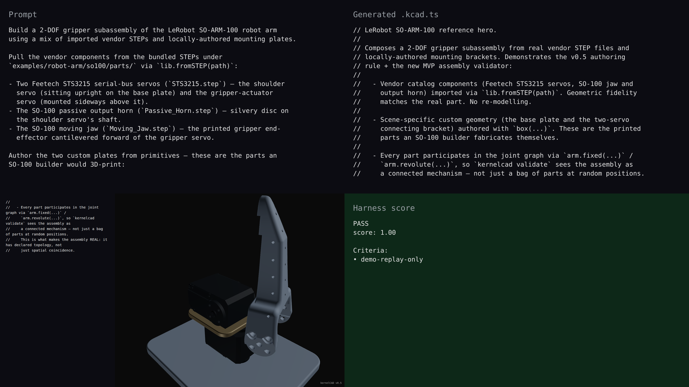

# v0.5 — `lib.fromSTEP` + real-CAD reference hero

## Hero artifact

so100

## Why memorable

- Recognizable in one second: a 2-DOF gripper subassembly of the LeRobot SO-ARM-100 — two real Feetech STS3215 servos, the SO-100 passive horn, and the SO-100 moving jaw, all pulled straight from LeRobot's upstream STEP files. Plus a base plate and a connector bracket authored locally with `box(...)`.
- New tool central: `lib.fromSTEP(path)` does all the heavy lifting — four lines bring in the vendor catalog (`servo1`, `servo2`, `horn`, `jaw`). The two locally-authored plates are the printed parts an SO-100 builder fabricates themselves. That contrast — vendor STEP imports for catalog components vs `box(...)` for scene-specific custom geometry — is the demo.
- Reads at 360°: real STS3215 bolt patterns, the printed jaw silhouette, the actual passive horn disc all show up clearly under the new PBR materials + three-point lighting from every angle of the rotation phase. Bundled `parts/SO100_Assembly.step` (7 MB, also imported via `lib.fromSTEP`) is the full pre-assembled 5-DOF follower for agents that want the entire arm in one line.

## What's new

This release adds **the parts library**: `lib.fromSTEP(path)` imports a STEP file as a Shape that composes with the rest of the kernel API (`.translate(...)`, `.rotate(...)`, `.color('servo')`, `arm.part(...)`). Path resolves relative to the calling `.kcad.ts`; absolute paths also accepted. Vendor catalog components (servos, bearings, fasteners, full preassembled arms) drop into a script with one line — no parametric re-authoring per component.

This release also upgrades the renderer to **physically-based shading**:

- `MeshStandardMaterial` with role-driven metalness/roughness: matte plastic for `servo` / `frame`, polished metal for `shaft` / `gear`, painted aluminium for `plate` / `beam`, brushed steel for `pin`.
- Three-point + rim lighting (key + fill + rim + low ambient) replaces the single directional light. Scene-attached so rotation reveals geometry.
- ACES filmic tone mapping with sRGB output color space.

These three changes affect every demo and every `kernelcad render` output — a renderer-wide upgrade, not just the SO-100 hero.

The previous v0.5 hero (`desktop-3axis.kcad.ts`) is kept in the repo as a primitive-composition tutorial — useful contrast for agents learning when to import vendor CAD vs author custom geometry from primitives.

