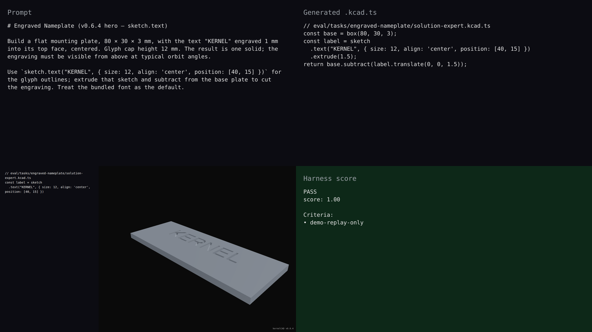

# v0.6.4 — engraved-nameplate hero

## Hero artifact

engraved-nameplate — a flat mounting plate with the word "KERNEL" cut into its top face. Built with the v0.6.4 `sketch.text(...)` primitive.

## Why memorable

- Recognizable in one second: a labeled plate that says exactly what it is — the agent's output is legible *as text*, not as an abstract solid.
- New tool central: the entire build hinges on `sketch.text("KERNEL", ...).extrude(1.5)` — without sketch.text there is no engraving, only a blank plate.
- Reads at 360°: rotation reveals the cut depth (1 mm into a 3 mm plate); the recessed "R" counter is visible from oblique angles.

## What's new

This release ships 2D text as a sketch-internal primitive. `sketch.text(content, opts)` returns a `Sketch` covering all glyph outlines of the rendered string; chain `.extrude(depth)` to get a 3D text feature, then `.subtract()` to engrave or `.union()` to raise the relief. Bundled font is Liberation Sans Regular (SIL OFL 1.1); pass `opts.font: fontPath('/abs/path.ttf')` to use a custom TTF. The new `add_text({ mode: 'sketch' })` MCP tool drives this from AST-edit workflows.

