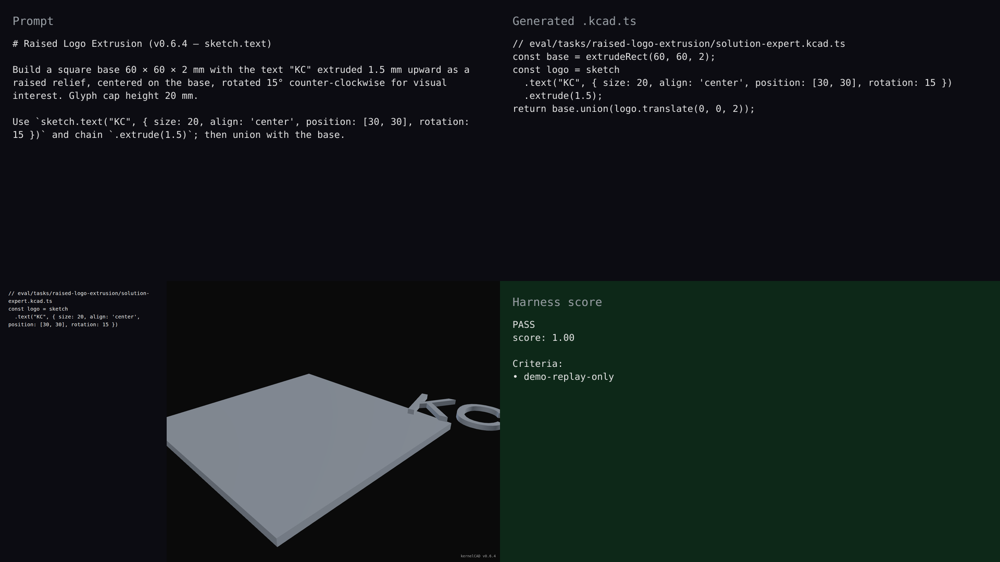

# v0.6.4 — raised-logo-extrusion hero

## Hero artifact

raised-logo-extrusion — a square base with "KC" extruded upward as raised relief, rotated 15° counter-clockwise. Built with the v0.6.4 `sketch.text(...)` primitive plus `.extrude(1.5)`.

## Why memorable

- Recognizable in one second: a branding plate with raised "KC" — looks like a vendor placard or product nameplate.
- New tool central: the relief is `sketch.text("KC", { rotation: 15 }).extrude(1.5)` — without sketch.text the base is featureless.
- Reads at 360°: rotation reveals the 15° tilt and the 1.5 mm relief height; the C glyph's open right side is visible from oblique angles.

## What's new

This release ships 2D text as a sketch-internal primitive. `sketch.text(content, opts)` returns a `Sketch` covering all glyph outlines of the rendered string; chain `.extrude(depth)` and `.union()` to land raised text features. `align`, `position`, and CCW `rotation` are all editable. Bundled font is Liberation Sans Regular (SIL OFL 1.1); pass `opts.font: fontPath('/abs/path.ttf')` to load a custom TTF. The new `add_text({ mode: 'sketch' })` MCP tool drives this from AST-edit workflows.

