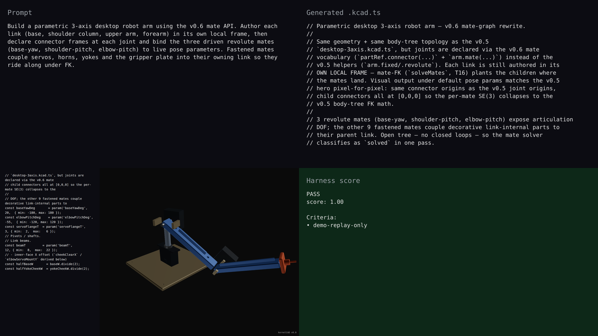

# v0.6.0 — desktop-3axis-mates hero

## Hero artifact

desktop-3axis-mates — a fully parametric 3-axis desktop robot arm built with the new mate API. Three live pose sliders (base-yaw, shoulder-pitch, elbow-pitch) drive the linkage through `arm.mate(..., 'revolute', { pose: paramRef })`; every other part (servos, horns, yokes, gripper plate) is anchored to its owning link via fastened mates so the whole kit moves as one body-tree.

## Why memorable

- Recognizable in one second: a tabletop 3-axis arm with three visibly distinct joints, structural beams, and a tool plate — instantly reads as "robot arm," not as an abstract chain of cylinders.
- New tool central: every joint and every coupling in the build is declared with `arm.mate(...)`. There is not a single `arm.fixed(...)` or `arm.revolute(...)` call — the v0.6 mate API is the only joint vocabulary used. Pose ParamRefs bind directly to the mate records so the live sliders re-pose the arm reactively.
- Reads at 360°: under default poses, the upper arm tilts up, the forearm folds back, and the gripper plate cantilevers forward. Rotation makes the joint axes legible from every angle; the FK chain is the visible story.

## What's new

This release ships the connector + mate layer for assemblies. Parts are authored in their own local frames; `arm.part(...).connector(name, opts)` declares named coordinate frames (frame / axis / planar / ball) on each part; `arm.mate(name, aRef, bRef, type, { pose })` couples two connectors with one of 7 mate types (fastened, revolute, prismatic, cylindrical, planar, ball, pin_slot). Capture-time pair-compatibility validation rejects mismatched joints before solve. `Assembly.solvedModel({validate})` returns a Scene whose per-part world transforms come from a Pattern-A forward-kinematics walk over the mate graph — same data flow as the industry-standard kinematic-tree systems. `validateAssemblyWithMates` reports a Solvespace-style 5-way status, and `kernelcad evaluate` flips the validate gate to `error` so harness runs fail fast on invalid geometry.

