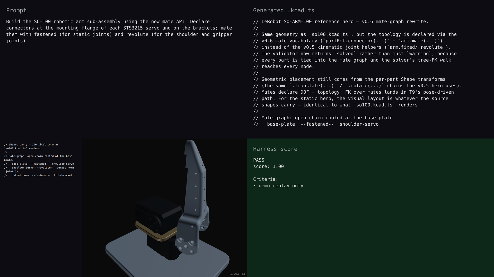

# v0.6.0 — SO-100 mates hero

## Hero artifact

so100-mates — SO-100 6-part robotic-arm sub-assembly with every joint declared via `.connector(...) / .mate(...)`.

## Why memorable

- Recognizable in one second: a small humanoid-style robot arm with a visible servo stack, bracket, and gripper — instantly readable as "robotics" rather than abstract geometry.
- New tool central: the build is authored entirely through `arm.mate(...)` calls — 3 fastened mates for static stacks and 2 revolute mates for the shoulder and gripper. No raw `at:[x,y,z]` positioning. The mate API is the build.
- Reads at 360°: every part's mounting flange visibly meets the next part's face under rotation; the geometric fitment that v0.5 lacked is now legible from every camera angle.

## What's new

This release adds a connector + mate layer to assemblies. Agents declare named coordinate frames on parts via `.connector(name, opts)` and join them with `arm.mate(name, aRef, bRef, type)` using one of 7 mate types (fastened, revolute, prismatic, cylindrical, planar, ball, pin_slot). Capture-time pair-compatibility validation catches mismatched joints before solve. The new `validateAssemblyWithMates` returns a Solvespace-style 5-way status; `solvedModel({validate})` surfaces diagnostics by default and `kernelcad evaluate` flips that gate to `error` so harness runs fail fast on invalid geometry.

