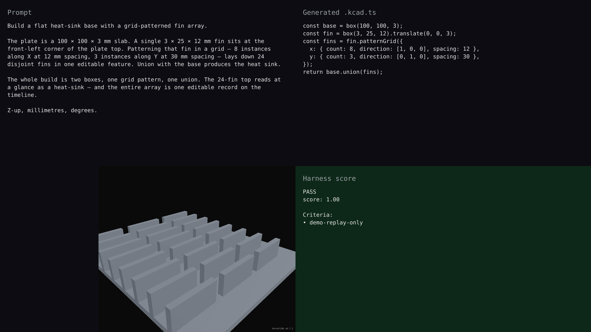

# v0.7.1 — grid heat-sink fin array

## Hero artifact

grid-heat-sink-fin-array — a 100 mm × 100 mm × 3 mm base plate with 24 cooling fins (3 mm × 25 mm × 12 mm each) laid out in an 8 × 3 grid, unioned into a single solid heat sink. The 24-fin top reads at a glance as a heat sink; the entire array is one editable record on the timeline.

## Why memorable

- Recognizable in one second: a flat plate with a dense regular array of vertical fins reads instantly as a heat sink — not a generic box or bracket, but a recognizable mechanical part whose grid topology is the visual punchline.
- New tool central: the build is two boxes, **one** `.patternGrid({ x, y })` call that produces all 24 fins as a single editable feature, and one union. Remove the pattern and the build collapses to one fin on a plate; the pattern is the part.
- Reads at 360°: rotation reveals both the X-row spacing (8 fins, 12 mm pitch) and the Y-row spacing (3 rows, 30 mm pitch), so both grid axes are legible from oblique angles.

## What's new

This release lands per-instance lineage on `Shape.patternLinear` / `.patternCircular` / `.patternGrid`. The pattern lowerer now threads `propagateTransformHistory` per instance and stamps each lineage entry with a virtual `<sourceId>_pattern_<i>` `featureId`, so `created` face/edge refs from the source feature (e.g. a hole's bore wall) resolve on every patterned instance. The per-instance fuse runs through `fuseWithHistory` + `mergeBooleanHistory` instead of plain `OcctBackend.union`, preserving naming history across the cumulative union. The captured `FeatureRecord` shape is unchanged — one pattern call is still one editable record on the timeline. A new `add_pattern_feature` MCP tool composes the three pattern variants from structured input.

