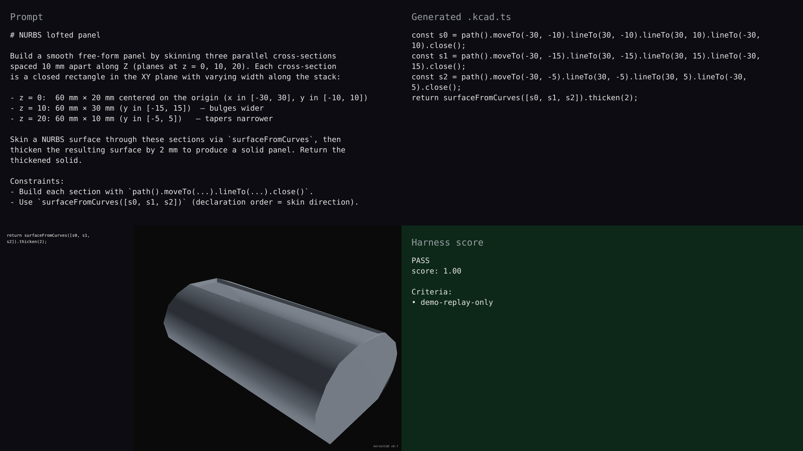

# v0.7 — NURBS lofted panel

## Hero artifact

nurbs-lofted-panel — a 60 mm × ~30 mm × 22 mm free-form panel skinned through three rectangular cross-sections (widening, narrowing) and thickened by 2 mm. The result is a smooth, non-prismatic solid that the existing Shape pipeline can boolean, fillet, or export to STEP.

## Why memorable

- Recognizable in one second: the panel's middle is visibly wider than its end caps — agents can now build free-form skinned solids that aren't extrudes, lofts of fixed cross-section, or boolean compositions of primitives.
- New tool central: `surfaceFromCurves([s0, s1, s2]).thicken(2)` is the entire surface construction — no helper script, no per-section transforms.
- Reads at 360°: the bulging middle and tapered ends stay recognizable as the camera rotates around the part.

## What's new

This release adds NURBS surface construction to the agent-facing kernel. Agents call `nurbsSurface(...)` to build a surface from an explicit control net, or `surfaceFromCurves(sections)` to skin through 2+ closed Sketch cross-sections. The returned `Surface` is a peer to `Shape` in the intent layer; `.thicken(t)` and `.toShape()` escape into the existing Shape pipeline (booleans, fillets, exports). Two new diagnostic codes (`feature.nurbs.degenerate-controls`, `feature.nurbs.degree-mismatch`) backstop the new validators; the catalogue grows from 24 to 26 codes.

