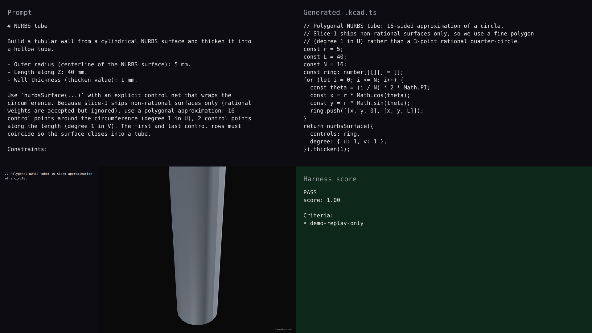

# v0.7 — NURBS tube

## Hero artifact

nurbs-tube — a 12 mm-diameter, 40 mm-long tube wall built from a 16-sided polygonal NURBS surface (degree 1 in U, degree 1 in V) thickened by 1 mm. The result is a closed hollow shaft the existing pipeline can boolean against, fillet, or export.

## Why memorable

- Recognizable in one second: the tubular cross-section closes into a recognizable hollow shaft — agents can build tubular geometry without revolve or sweep, expressing it as a control-net surface that wraps.
- New tool central: `nurbsSurface({ controls, degree: { u:1, v:1 } }).thicken(1)` is the entire body — one capture call.
- Reads at 360°: the perpendicular-to-Z axis stays clean from every angle; the rotating frame highlights the polygonal-but-tubular construction.

## What's new

This release adds NURBS surface construction to the agent-facing kernel. Agents call `nurbsSurface(...)` to build a surface from an explicit control net (16 control points in U times 2 in V here), or `surfaceFromCurves(sections)` to skin through 2+ closed Sketch cross-sections. The returned `Surface` is a peer to `Shape` in the intent layer; `.thicken(t)` and `.toShape()` escape into the existing Shape pipeline (booleans, fillets, exports). Two new diagnostic codes (`feature.nurbs.degenerate-controls`, `feature.nurbs.degree-mismatch`) backstop the new validators; the catalogue grows from 24 to 26 codes. Slice-1 ships non-rational surfaces only; rational weights (for exact circles via 3-point quarter arcs) are accepted at the API but currently ignored.

