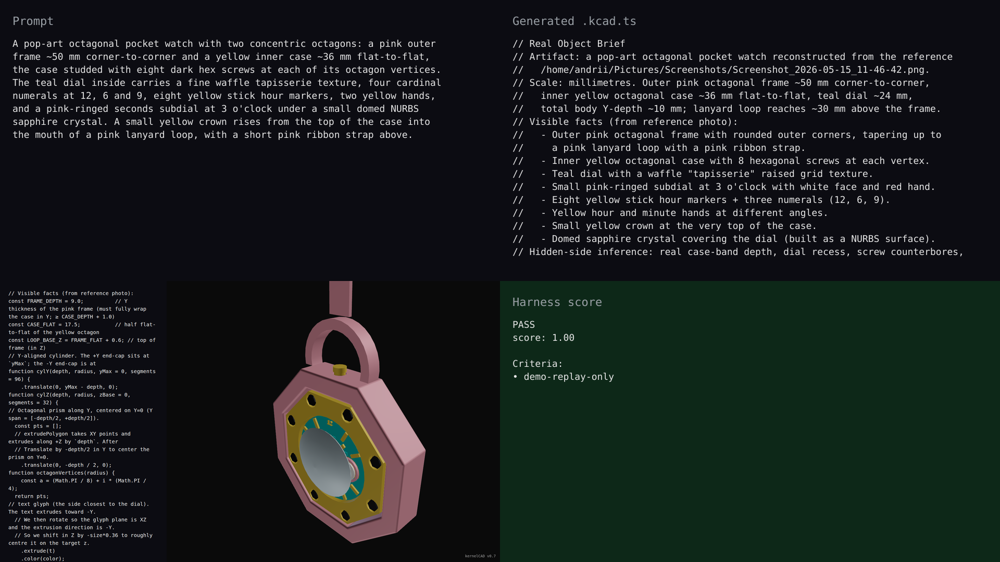

# v0.7.0 — pocket-watch hero

## Hero artifact

pocket-watch — a pop-art octagonal pocket watch with a pink lanyard loop, a recessed yellow octagonal case set inside a deeper pink frame, eight hex-head bezel screws at the octagon vertices, a teal dial with raised stick markers and TrueType numerals, a pink-ringed sub-seconds at 3 o'clock, a yellow crown above 12, and a domed sapphire crystal arching over the dial. The whole assembly captures 96 named parts joined by 95 fixed mates with zero BREP interferences.

## Why memorable

- Recognizable in one second: pink frame + yellow octagonal case + teal dial + lanyard loop + bold color blocks read instantly as a pop-art pocket watch in every render, not as a stack of primitives.
- New tool central: the dial numerals "12", "9" and "6" are real `sketch.text` glyphs extruded into raised relief on the dial face, and the domed sapphire crystal that arches over the entire dial is a single periodic-V `nurbsSurface` thickened into a solid lens — both v0.7 features are the most visually prominent things on the build.
- Reads at 360°: the lanyard loop above and the curving crystal dome in front are visible from front, iso, right and top; rotation shows the pink frame fully wrapping the yellow case in depth, the dome silhouette emerging from the bezel, and the 8 hex screws walking around the octagon.

## What's new

This release ships freeform geometry at the API surface. `nurbsSurface({ controls, degree, knots?, periodic? })` accepts a rectangular grid of Vec3 control points and returns a `Surface` peer to `Shape`; `surfaceFromCurves(sections)` skins a NURBS surface through 2+ sketches; both expose `.thicken(t)` (one-sided offset solid) and `.toShape()` (planar fall-through). `sketch.text(value, opts)` parses a TrueType font and returns a real `Sketch` whose outlines participate in every existing sketch operation — `.extrude(t)`, `.revolve()`, `.sweep(rail)`, `.reflect(plane)`, boolean union/subtract with neighbouring sketches — so glyphs become legitimate parametric geometry instead of decals.

