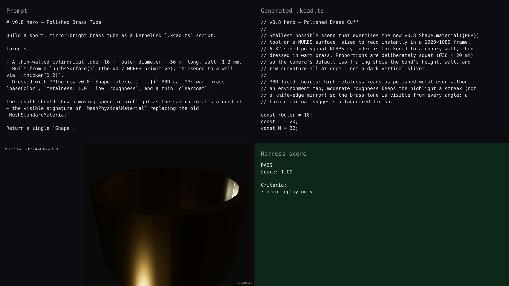

# v0.8 — synchronized live-build demo

## Hero artifact

polished-brass-tube

## Why memorable

- Recognizable in one second: a chunky mirror-bright brass cuff that reads as polished metal at a glance, not as a wireframe primitive.
- New tool central: the v0.8 `Shape.material({metalness, roughness, clearcoat})` call replaces flat `.color()` — the warm specular highlight gliding around the surface during rotation is the visible signature.
- Reads at 360°: the rotate phase sweeps the camera a full turn so the highlight tracks the light source and the wall thickness, rim curvature, and brass tone are legible from every angle, not just the hero pose.

## What's new

v0.8 adds physically-based materials to `Shape` and a `referenceImage()` construction-only overlay to the Studio viewport, completing the visible-quality lane of the NURBS Slice A. The renderer now constructs `MeshPhysicalMaterial`, so `metalness`, `roughness`, `clearcoat`, `ior`, `transmission`, and `sheen` all round-trip from script to viewport.

