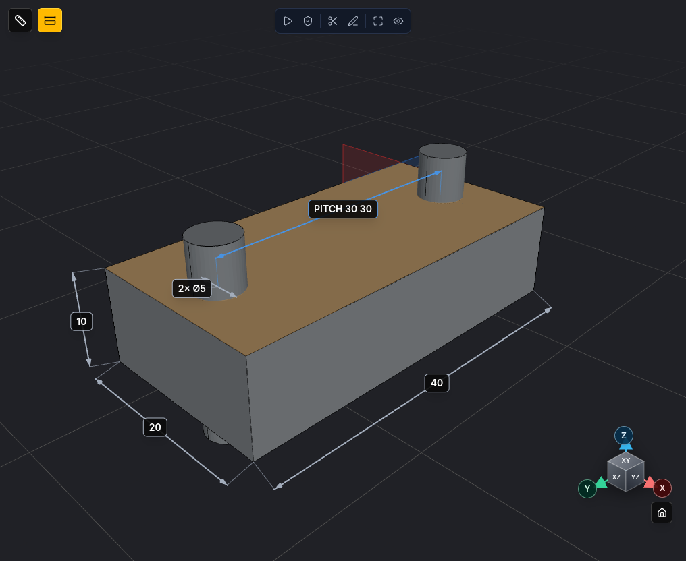
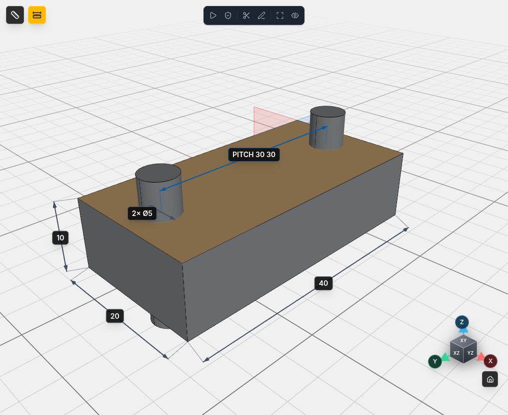
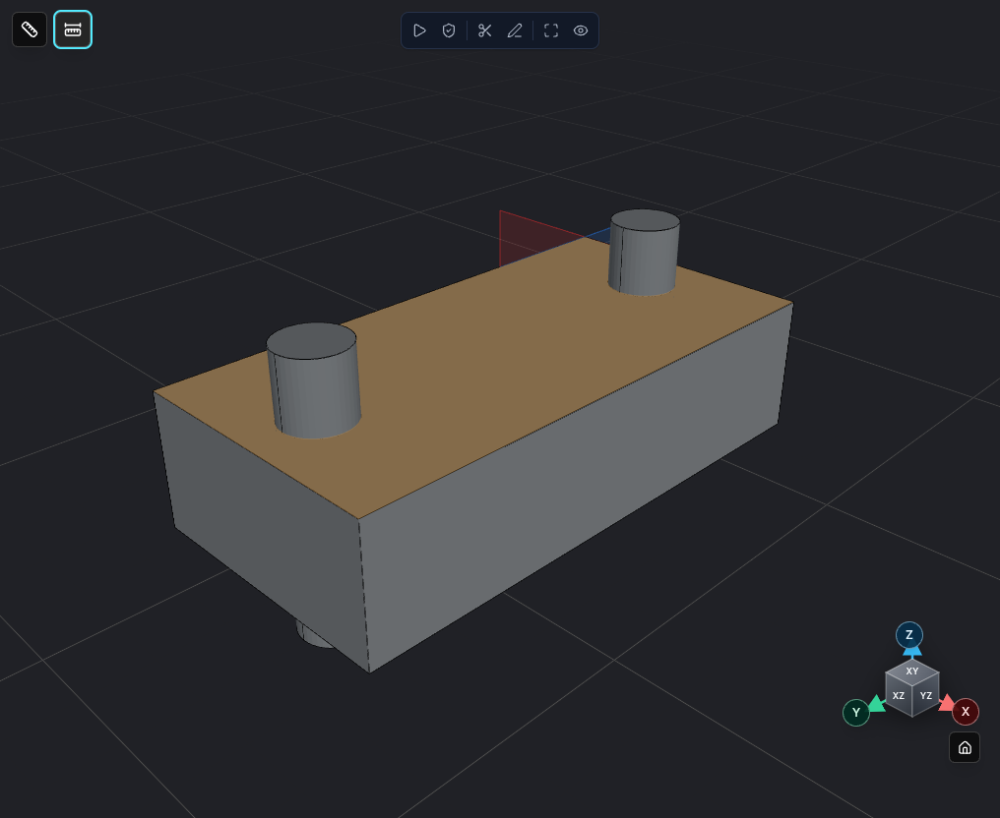
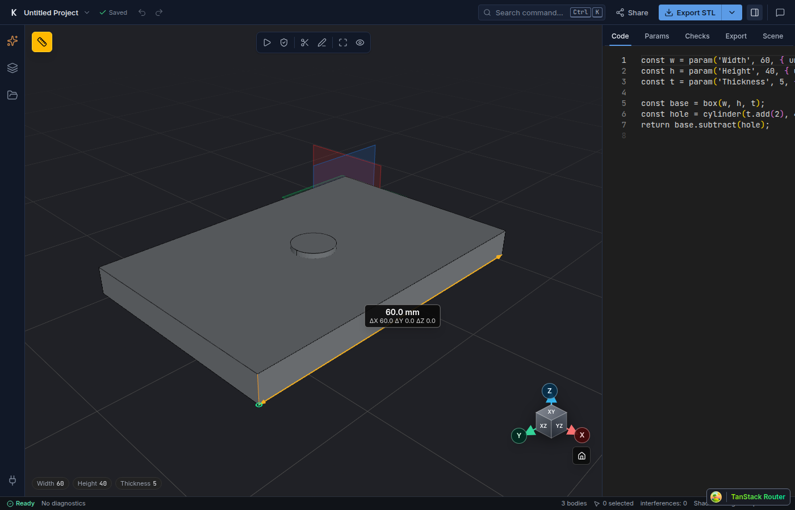
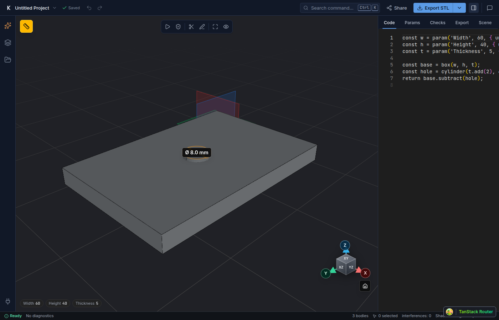

# Dimensions, Measure and drawing download

You can read the size of a part straight off the 3D view, measure anything you click on, and take a dimensioned drawing away as a PDF.

## The Dimensions toggle

Two buttons sit top-left of the 3D viewer: Measure is the ruler button, and Dimensions is the button with the ruler-and-ticks icon next to it. It is there in Studio, on shared `/p/<slug>` pages and in the ChatGPT viewer.







It is off by default. It turns on by itself when the model declares its own dimensions (see below). Add `?dims=1` to the URL to force it on.

Without any declared dimensions, kernelCAD adds a set of automatic ones:

- overall size
- holes, grouped: `2× Ø5`
- hole spacing
- radii, grouped: `12× R3`
- chamfers

Limits:

- At most 20 per part.
- An assembly with more than 8 parts shows overall size only.
- A heavy model may show a partial set.

Colour tells you where a dimension came from. Declared dimensions are blue (the accent colour). Automatic ones are grey.

Models saved before this feature show overall size only, with the hint "Detailed dimensions appear after the model is republished." Republish the model to get the full set.

## Measure

Click the Measure button (the plain ruler), then click two points. You get the distance and the ΔX, ΔY and ΔZ between them.



The tool snaps to corners, edges and faces. Click once on a round edge to read its diameter.



Press Esc to clear the measurement.

## Declare your own dimensions

Call `shape.dimension()` in the script. It returns the shape, so you can chain it.

```ts
shape.dimension({ kind: 'linear', from, to, label })
shape.dimension({ kind: 'diameter', edge, label })   // or kind: 'radius'
shape.dimension({ kind: 'angular', from, to, label })   // from and to are edge queries
```

An anchor is one of:

- `[x, y, z]`, a point
- `{ edge: EdgeQuery }`
- `{ face: FaceQuery }`

On a linear dimension, a circular edge anchor means the hole centre, so you get centre-to-centre distances.

The label is a name. kernelCAD appends the value, so `'hole spacing X'` shows as `hole spacing X 40` and `'bolt hole'` shows as `bolt hole Ø5`.

An angular dimension measures the angle between two edges: `from` and `to` are edge queries, not points. It is shown as a straight callout with the angle in degrees.

### Example: mounting bracket

This is `examples/gallery/mounting-bracket-dimensioned.kcad.ts`. A 60 x 40 x 6 base plate with four 5 mm holes and a 6 mm upright.

```ts
const baseW = 60;
const baseD = 40;
const t = 6;
const uprightH = 40;

const base = box(baseW, baseD, t).holes('top', {
  positions: [{ u: -20, v: -12 }, { u: 20, v: -12 }, { u: -20, v: 6 }, { u: 20, v: 6 }],
  diameter: 5,
  depth: 'through',
});

let bracket = base.union(box(baseW, t, uprightH).translate(0, baseD - t, t));

const hole = (x: number, y: number) => ({ edge: { ofCurveType: 'CIRCLE' as const, near: [x, y, t] as [number, number, number] } });

bracket = bracket
  .dimension({ kind: 'linear', from: hole(10, 8), to: hole(50, 8), label: 'hole spacing X' })
  .dimension({ kind: 'linear', from: hole(10, 8), to: hole(10, 26), label: 'hole spacing Y' })
  .dimension({ kind: 'linear', from: [0, 0, 0], to: [0, 0, t], label: 'thickness' })
  .dimension({ kind: 'diameter', edge: hole(10, 8).edge, label: 'bolt hole' });

return bracket;
```

The viewer shows `hole spacing X 40`, `hole spacing Y 18`, `thickness 6` and `bolt hole Ø5`. Because the model declares dimensions, the toggle starts on.

Agents use the same call in source. `evaluate_script` returns the declared dimension values, so an agent can check them without looking at the picture.

## Drawing (PDF)

On a `/p/<slug>` page, open the Download dropdown (next to Download STL) and choose Drawing (PDF). In Studio, use the export menu or the command palette: Export Drawing (PDF). The drawing is A3 with automatic dimensions.

Declared dimensions also appear on the PDF and SVG drawing. When a model declares any, they replace the automatic bounding-box dimensions on the drawing.

## Feedback

The ChatGPT viewer has a small Feedback button, and `/p` pages have Send feedback.
