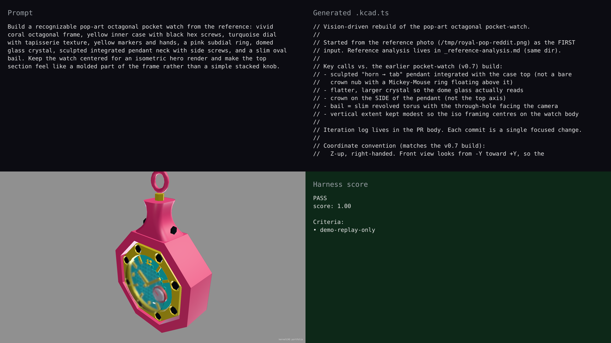

# portfolio — synchronized live-build demo

## Hero artifact

pocket-watch-v2

## Why memorable

- Recognizable in one second: saturated pink body, yellow octagonal bezel, black screws, turquoise dial, and side crown make the watch silhouette read immediately.
- New tool central: visual review exposed material/rendering gaps, while `validate --physical` and interference checks caught floating glass, hands, and fixed-joint air gaps.
- Reads at 360°: the crown, bail, lens rim, hand stack, and case are modeled as connected parts rather than a front-only facade.

## What's new

This release demonstrates a tighter physical-review loop for agent-built CAD: the model now has a mounted clear lens, a real side winding crown, seated case geometry, and deterministic checks that fail unsupported fixed joints before a visually broken artifact reaches the gallery.

